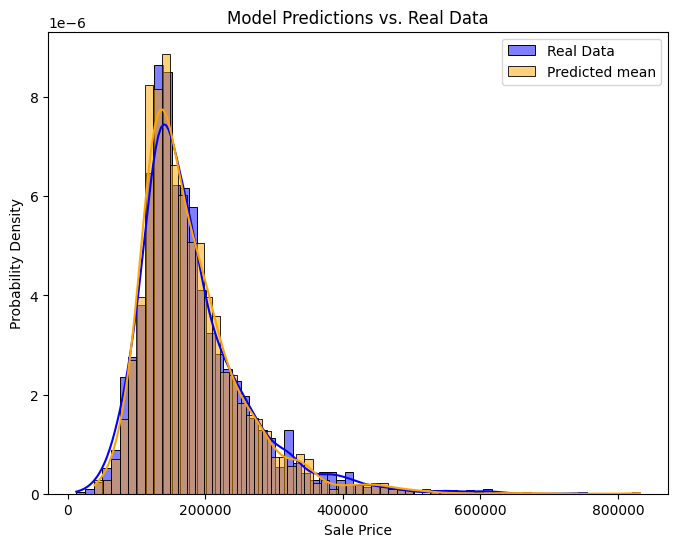
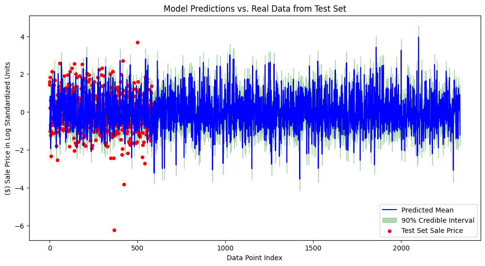
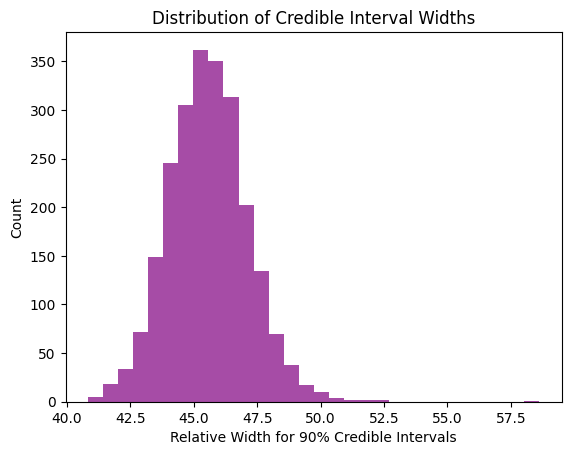

# Bayesian House App
Interactive and reactive house-purchasing app based on machine learning prediction.

## Installation
Download this repo first.

Then, install all dependencies:

``` sh
pip3 install .
```

## Running the App
You can run the app with:
``` sh
python3 -m marimo run BayesianWebApp.py
```

You can also run the app as a marimo notebook with:
``` sh
python3 -m marimo edit BayesianWebApp.py
```

**If marimo command not found, please check the PATH:**
``` sh
pip3 show marimo
```

## About
This app is designed to assist users in making house-purchasing decisions. Users can browse available house data from the database, input an asking price, and receive purchase advice generated by the app. A key feature is that the advice reflects the model’s degree of confidence, explicitly quantifying uncertainty. This is achieved through training a **Bayesian Regression model**, which generates posterior distributions that inform the decision-making process.

The process began with raw data from Kaggle’s Ames Housing Dataset (CSV). This data was cleaned and transformed using **SQLMesh** and the raw CSV data was ingested and incrementally transformed through a pipeline of SQLMesh models, where each model built on the outputs of the previous stage, resulting in the final cleaned dataset. Data cleaning and transformations include handling outliers, taking the logarithm of features, and standardization. The final cleaned dataset was queried into a Pandas DataFrame and used to train the Bayesian regression model via **stochastic variational inference (SVI)**. This was implemented using **Pyro**, a probabilistic programming language, which allowed us to define the model’s joint probability density (the product of priors and likelihood) and specify a guide—Pyro’s term for the variational distribution that approximates the true posterior. Approximating the posterior is necessary because computing the evidence in Bayes’ rule is typically intractable. To perform the approximation, SVI optimizes an objective function known as the **Evidence Lower Bound (ELBO)**. The algorithm takes stochastic gradient steps to maximize the ELBO, which is mathematically equivalent to minimizing the **Kullback–Leibler (KL) divergence (a measure of difference in information between two distributions or relative entropy)** between the variational distribution and the true posterior. Intuitively, a smaller KL divergence means the approximation is closer to the true posterior, with a value of zero indicating an exact match. After the model’s posterior distributions were computed, credible intervals were derived and used in the decision logic. Finally, the user interface was built with **marimo (reactive Python notebook)**, and CRUD functionality was implemented with **SQLModel (Object-relational mapping)**.

Most of the model’s credible intervals indicate roughly 46% uncertainty between the lower and upper bounds. This corresponds to approximately ±23% uncertainty on either side of the mean prediction. In other words, for a typical prediction, the model is 90% confident (because 90% credible interval) that the true sale price lies within ±23% of its predicted value.

For the decision-making component of this app, the model uses the width of the credible intervals. Specifically, if the asking price is below the lower bound of the interval, the house is considered a bargain, since the lowest price predicted by the model (the lower bound) exceeds the asking price. Conversely, if the asking price is above the upper bound, the house is considered overpriced. If the asking price falls within the interval, the difference between the mean of the predicted sale prices and the asking price determines potential gain or loss: positive values indicate a potential gain, while negative values indicate a potential loss.

In future versions, potential improvements include adding more ways for users to interact with the data beyond the scatterplot and eliminating the shuttering that occurs each time an action is performed. Additionally, the app could be enhanced by integrating the CRUD functionality with the house decision logic so that any CRUD actions are immediately reflected in the decision-making output.




**You can see that the model is pretty accurately predicting the true sale prices.**




**Model Performance. Generalizes well on unseen data.**




**Majority of relative widths are around 46% (so ±23%). Distribution is Gaussian.**
